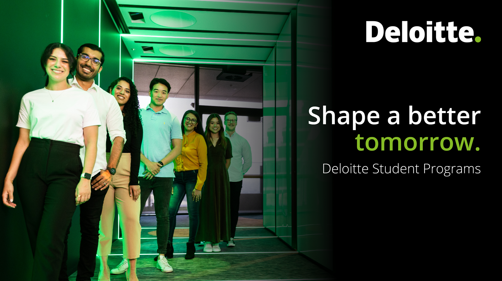
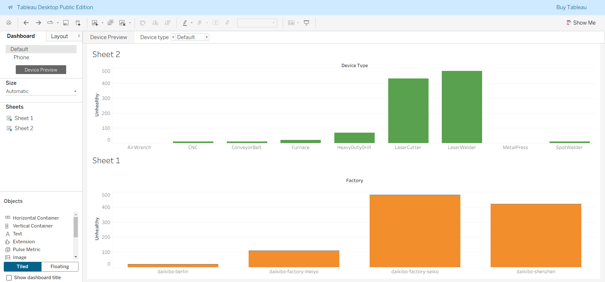

# 📊 Deloitte Australia – Data Analytics Job Simulation (Forage)

---

## 🏢 Organization

- **Offered by:** Deloitte Australia  
- **Platform:** Forage  
- **Mode:** Self-paced virtual job simulation  

  

---

## 📑 Table of Contents

- <a href="#project-overview">📌 Project Overview</a>
- <a href="#program-context">🏢 Program Context</a>
- <a href="#why-this-simulation">💡 Why This Job Simulation</a>
- <a href="#project-objectives">🎯 Project Objectives</a>
- <a href="#skills-developed">🧠 Skills Developed</a>
- <a href="#how-the-program-works">🔄 How the Program Works</a>
- <a href="#tasks-overview">🧩 Tasks Overview</a>
- <a href="#task-one">📈 Task One: Data Analysis</a>
- <a href="#task-two">🕵️ Task Two: Forensic Technology</a>
- <a href="#dashboard-development">📊 Dashboard Development</a>
- <a href="#tools-technologies">🛠️ Tools & Technologies</a>
- <a href="#key-insights">📌 Key Insights</a>
- <a href="#learning-outcomes">🚀 Learning Outcomes</a>
- <a href="#repository-structure">📁 Repository Structure</a>
- <a href="#certificate-usage">🎓 Certificate & Career Value</a>
- <a href="#conclusion">🔚 Conclusion</a>
- <a href="#connect">📬 Connect With Me</a>

---

## 📌 Project Overview

This repository showcases my work from the **Deloitte Australia – Data Analytics Job Simulation**, offered through **Forage**.  
The program simulates real-world consulting tasks performed by Deloitte professionals, allowing participants to gain hands-on experience in **data analysis, forensic investigation, and dashboard development** within a risk-free, self-paced environment.

The simulation focuses on converting raw business data into meaningful insights, closely reflecting how analytics is applied in professional services at Deloitte.

---

## 🏢 Program Context

- **Organization:** Deloitte Australia  
- **Platform:** Forage  
- **Domain:** Data Analytics & Forensic Technology  
- **Duration:** 1–2 Hours (Self-paced)  
- **Assessment:** No grades, no exams  
- **Outcome:** Completion Certificate  

Deloitte positions itself as a professional services firm solving today’s problems while preparing for tomorrow. This job simulation is designed to help students and early professionals explore how their analytical skills can be applied in real consulting scenarios.

---

## 💡 Why This Job Simulation

This simulation provides a **risk-free introduction** to real workplace analytics at Deloitte Australia.  
It helps learners:

- Experience real consulting-style tasks
- Build confidence through guided examples
- Understand how data analytics supports business decisions
- Prepare for interviews with practical explanations

Rather than assigning a fixed career path, Deloitte encourages individuals to **shape their own journey**, and this simulation reflects that philosophy.

---

## 🎯 Project Objectives

The key objectives of this job simulation were to:

- Analyze complex business and telemetry datasets
- Identify trends, patterns, and anomalies
- Apply forensic thinking to investigate data irregularities
- Build interactive dashboards for stakeholders
- Communicate insights clearly and professionally

---

## 🧠 Skills Developed

Through this simulation, I practiced and strengthened the following skills:

- Data Analysis  
- Data Modeling  
- Data Visualization  
- Forensic Data Investigation  
- Spreadsheet-Based Analysis  
- Structured Problem Solving  
- Business Insight Generation  

---

## 🔄 How the Program Works

- Tasks are guided by **pre-recorded videos** from Deloitte professionals  
- Example solutions are provided for learning support  
- No live sessions — fully self-paced  
- Certificate issued upon completion  
- Can be added to **LinkedIn, resume, and portfolio**  

---

## 🧩 Tasks Overview

The program consists of two core tasks designed to simulate real client-facing analytics work:

1. **Data Analysis & Dashboard Creation**  
2. **Forensic Technology & Equality Analysis**

---

## 📈 Task One: Data Analysis

**Time Required:** 30–60 Minutes  

### What I Did

- Analyzed the client’s telemetry data across multiple factory locations
- Identified which locations experienced the highest machine breakdowns
- Determined machine types contributing most to failures
- Transformed raw data into meaningful insights

### What I Learned

- How to explore operational datasets
- How to visualize patterns using dashboards
- How analytics supports operational decision-making

---

## 🕵️ Task Two: Forensic Technology

### What I Did

- Investigated employee data related to gender pay equality
- Classified equality scores using logical rules
- Identified potential areas requiring closer review
- Applied forensic thinking to structured datasets

### Key 

- Equality analysis
- Logical classification
- Risk identification
- Preventive recommendations

---

## 📊 Dashboard Development

- Designed an interactive dashboard to present insights
- Used charts and filters for stakeholder readability
- Focused on clarity, accuracy, and business relevance
- Converted analytical findings into visual storytelling

---

## 🛠️ Tools & Technologies

- **Microsoft Excel** – data analysis, classification logic  
- **Tableau / Power BI** – data visualization & dashboards  
- **Spreadsheets** – structured analysis and calculations  

---

## 📌 Key Insights

- Certain factory locations showed significantly higher machine failures
- Specific machine types were major contributors to breakdowns
- Equality score analysis highlighted areas needing monitoring
- Demonstrated how analytics drives evidence-based decisions

---

## 🚀 Learning Outcomes

This job simulation helped me understand how analytics is applied in a **real consulting environment**.  
It offered an ideal balance between learning concepts and applying them practically, strengthening both technical and business-thinking skills.

---

## 📁 Repository Structure

├── Deloitte Australia - Data Analytics Job Simulation
├──
│ └── images
├──
│ └── daikibo-telemetry-data.json
├── 
│ └── Deloitte Australia - Data Analytics Job Simulation.pdf
└──
│ └── Deloitte Australia - Data Analytics Job Simulation.pptx
├── 
│ └── README.md
├──
│ └── Task 2 Guide.pdf
└── 
  └── Task 5 Equality Table.xlsx

---

## 🎓 Certificate & Career Value

- Added as an extracurricular activity on LinkedIn  
- Strengthens resume credibility  
- Helps confidently answer interview questions  
- Demonstrates motivation and practical exposure  

---

## 🔚 Conclusion

The **Deloitte Australia Data Analytics Job Simulation** was a highly practical and engaging experience.  
It provided valuable exposure to real-world analytics, forensic thinking, and dashboard-driven storytelling — closely mirroring how Deloitte applies data analytics in professional services.

---

## 📬 Connect With Me

<!-- Typing Animation / 🤝 Connect with me -->

<!-- 💼 LinkedIn -->

<!-- 📮 Gmail -->

<!-- ✖️ X -->
  
<!-- 🆔 GitHub -->

<!-- 🌐 Website -->

<!-- Typing Animation / 🤝 Thanks for Visiting! -->

<!-- ⭐💫 Shower stars if you like my repos -->

---

## 🖼️ Project Visuals

 
 

---
